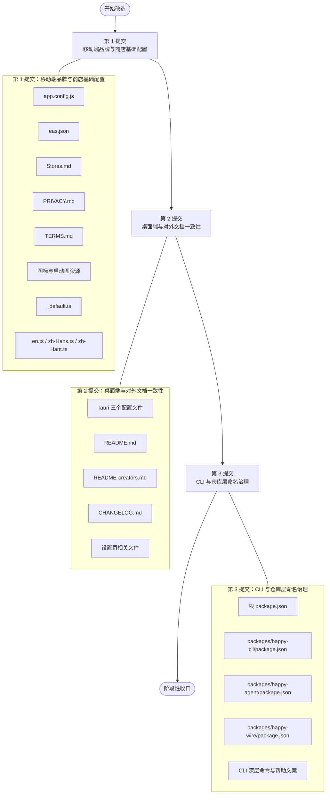

# 20260402 需求清单：helloVibe 工程改造文件级清单

## 1. 文档目的

这份文档只做一件事：

把“当前工程如何改成 helloVibe”拆成可以直接执行的文件级清单。

它不是宣传文案，也不是苹果提审清单。

它更偏研发落地视角，回答三个问题：

1. 先改哪些文件
2. 每个文件为什么要改
3. 哪些改动属于 P0 / P1 / P2

---

## 2. 使用方式

建议把这份文档当成后续提交代码仓库前的分批改造清单。

优先级建议如下：

### P0

必须先改，否则 helloVibe 对外品牌无法成立，或者会直接影响打包、上架、审核一致性。

### P1

建议第二批改，主要解决用户可见体验一致性、桌面端一致性、法律与公开材料一致性。

### P2

第三批再改，主要是仓库内部历史命名、兼容层、深层代码引用、长期清理项。

---

## 3. 当前总判断

当前工程里的名字并不是单一旧名，而是三套并存：

1. `Happy / Happy Coder`
2. `happy / happy-coder`
3. `easycode`

因此真正要做的不是“统一替换字符串”，而是：

1. 先统一对外品牌
2. 再统一打包与发布标识
3. 再处理 CLI 与仓库内部命名
4. 最后清理历史兼容痕迹

---

## 4. P0：第一批必须改的文件

这一批建议优先单独做一个 PR 或一次明确提交。

## 4.1 App 主配置

### 1. `packages/happy-app/app.config.js`

**为什么必须先改**

这是当前移动端打包与上架的总入口。

**当前已看到的问题**

1. `name` 还是 `easycode`
2. `slug` 还是 `happy`
3. `scheme` 还是 `happy`
4. iOS `bundleIdentifier` 还是 `com.easycode.app*`
5. `associatedDomains` 还是 `app.happy.engineering`
6. Android intent filter 也还是旧域名

**建议动作**

1. 确定 helloVibe 的正式 `name`
2. 确定 helloVibe 的 `slug`
3. 确定 helloVibe 的 `scheme`
4. 确定 helloVibe 的 iOS / Android 包标识
5. 确定是否切换新的域名和 Universal Link
6. 重新检查 `updates.url`、`extra.eas.projectId` 是否继续沿用原 Expo 项目

**是否阻塞**

- 阻塞打包
- 阻塞上架
- 阻塞品牌统一

## 4.2 苹果提交配置

### 2. `packages/happy-app/eas.json`

**为什么必须先改**

这决定 EAS 构建与 App Store 提交目标。

**当前已看到的问题**

1. `submit.production.ios.ascAppId` 已绑定当前旧应用坑位
2. build profile 仍然沿用当前工程体系

**建议动作**

1. 创建 helloVibe 的 App Store Connect 应用后，更新 `ascAppId`
2. 确认 development / preview / production 三套 profile 是否继续保留
3. 确认三套环境的品牌显示策略

**是否阻塞**

- 阻塞苹果提交
- 阻塞 TestFlight

## 4.3 App Store 文案基线

### 3. `packages/happy-app/Stores.md`

**为什么必须先改**

这是当前最直接的商店文案基线。

**当前已看到的问题**

1. 名称仍是 `Happy Coder`
2. 副标题仍是 `Claude Code on the go`
3. 整体定位仍是单工具 mobile companion
4. 与 helloVibe 的“氛围编程 + 多设备 / 多环境 / 多工具”定位不一致

**建议动作**

1. 重写 App Name
2. 重写 Subtitle
3. 重写 Keywords
4. 重写 Full Description
5. 重写 Promotional Text
6. 重新检查 Privacy / Support / Marketing URL

**是否阻塞**

- 阻塞商店材料一致性
- 阻塞苹果审核表达

## 4.4 法律文本

### 4. `packages/happy-app/PRIVACY.md`

**为什么必须先改**

隐私政策是上架必备项，也是用户最容易看到的正式文档之一。

**当前已看到的问题**

1. 标题还是 `Privacy Policy for Happy Coder`
2. 正文主体仍然是 `Happy Coder`
3. 描述仍围绕旧产品模型展开

**建议动作**

1. 标题统一成 helloVibe
2. 正文里的品牌名统一
3. 核对数据采集说明是否和现在的 PostHog、RevenueCat、Push Token 使用情况一致
4. 如果产品模型已经从 companion 改为账号化产品，正文也要同步改

**是否阻塞**

- 阻塞上架
- 阻塞合规一致性

### 5. `packages/happy-app/TERMS.md`

**为什么必须先改**

Terms 和 Privacy 一样，属于上架与正式产品必要材料。

**当前已看到的问题**

1. 仍然以 `Happy` 为主体
2. About 与免责声明仍是旧名字
3. 和 helloVibe 当前对外定义不一致

**建议动作**

1. 全量统一品牌名
2. 核对第三方服务描述是否仍适用
3. 如果未来有订阅、套餐、正式账号体系，要考虑补相应条款

**是否阻塞**

- 阻塞上架
- 阻塞法务一致性

## 4.5 图标与启动资源

### 6. `packages/happy-app/sources/assets/images/*`

**为什么必须先改**

即使名称改了，如果图标、通知图标、启动图还是旧视觉，品牌就没有真正完成切换。

这里应直接视为一个独立的 P0 品牌需求，不是附属小改动。

**当前已看到的问题**

1. 当前主图标、通知图标、Android 自适应图标、favicon、启动图仍然沿用旧品牌时期的抽象 `H` 视觉
2. 这套视觉不适合 helloVibe 当前品牌
3. 用户最先看到的品牌触点仍然会停留在旧印象上

**当前已知关联**

`app.config.js` 已直接引用：

1. `icon.png`
2. `icon-notification.png`
3. `icon-adaptive.png`
4. `icon-monochrome.png`
5. `favicon.png`
6. `splash-android-light.png`
7. `splash-android-dark.png`

**建议动作**

1. 统一替换为 helloVibe 视觉资产
2. 同时检查浅色 / 深色 / Android / 通知图标
3. 确保导出尺寸满足 App Store 要求
4. 把这部分按单独需求跟踪，不要混在“文案顺手一起改”里

**建议执行顺序**

1. 先确认 helloVibe 主图标视觉方案
2. 一次性导出主图标、通知图标、自适应图标、单色图标、favicon、浅色启动图、深色启动图
3. 保持 `app.config.js` 当前引用路径不变，直接替换对应文件
4. 构建后逐项检查桌面图标、通知图标、启动图是否实际生效

**最小验收标准**

1. 用户在桌面第一眼看到的是 helloVibe 新视觉，而不是旧 `H`
2. Android 通知栏图标在小尺寸下仍可识别
3. 浅色 / 深色启动图都与 helloVibe 品牌一致
4. Web favicon 与移动端主图标属于同一套视觉体系
5. 资源替换后 `app.config.js` 引用路径不失效

**资源交付规格**

1. 统一交付 `.png` 文件，直接覆盖当前文件名
2. 主图标、favicon、启动图中心符号必须属于同一套 helloVibe 视觉语言
3. 通知图标与单色图标必须优先保证小尺寸识别，不依赖细线和复杂纹理
4. Android 自适应图标前景需要预留足够安全边距
5. 启动图不要堆文案，只保留品牌视觉主体

**替换后验证方法**

1. 检查 `app.config.js` 中 7 个资源引用路径是否未被破坏
2. 重新读取 Expo 配置，确认资源路径可解析
3. 检查 iOS / Android 桌面图标是否已更新
4. 检查 Android 通知栏图标是否清晰、未裁残
5. 检查浅色 / 深色启动图与 Web favicon 是否同时完成更新

**给设计的最小交付表**

1. `icon.png`
   - iOS / Expo 主图标
   - 需要作为 helloVibe 正式主图标落地
2. `icon-notification.png`
   - Android 通知图标
   - 需要优先保证极小尺寸识别
3. `icon-adaptive.png`
   - Android 自适应图标前景
   - 需要主体居中并预留安全边距
4. `icon-monochrome.png`
   - Android 单色图标
   - 需要在纯黑或纯白场景下独立成立
5. `favicon.png`
   - Web favicon
   - 需要与主图标保持同一核心符号
6. `splash-android-light.png`
   - Android 浅色启动图
   - 需要只保留品牌主视觉，不放副标题和小字
7. `splash-android-dark.png`
   - Android 深色启动图
   - 需要与浅色版保持同一构图，只做明暗适配

**转发时的执行提醒**

1. 这 7 个文件尽量一次性交付，避免只替换其中一部分
2. 文件名直接按当前工程固定名称输出，方便工程侧直接覆盖
3. 设计探索可以有多个方向，但最终落地方案必须满足多端统一和小尺寸可识别

**可直接贴给 Figma 的一句话**

请基于 `HelloVibe` 当前品牌，重新设计并导出一整套移动端图标与启动图资源，覆盖主图标、通知图标、自适应图标、单色图标、favicon、浅色/深色启动图；要求统一品牌识别、适合小尺寸显示，并可直接按现有文件名替换工程资源。

**可直接贴给 Figma AI / Make 的提示词**

为 `HelloVibe` 设计一套现代、简洁、友好的移动端品牌图标系统，品牌气质偏向“轻松开始你的第一个 vibe coding”。请体现智能、连接、流动感、开始感，但不要沿用旧抽象 `H` 视觉，也不要做得复杂到影响小尺寸识别。请在同一视觉体系下输出主图标、通知图标、自适应图标前景、单色图标、favicon、浅色启动图、深色启动图；要求中心符号统一、适配深浅背景、适合手机桌面和通知栏。启动图只保留品牌主视觉，不放副标题、口号、小字。最终请按当前工程文件名直接导出 `.png`。

**可继续尝试的 3 个方向**

1. 偏科技感：更现代、更克制，强调智能、连接、流动感，但不能牺牲小尺寸识别
2. 偏温和感：更友好、更轻松上手，强调陪伴感和开始感，但不能幼稚或卡通化
3. 偏产品化感：更成熟、更可信，像正式上线产品，强调稳定、统一、易识别

**下一稿具体修改说明**

1. 主路线以第二组 `hv + 底部弧线` 为基础，不再回到旧 `H`
2. 主图标继续保留圆角方形底板，但要提升 `hv` 的字母识别
3. 可参考第一组的字母贴合度，但不要带回细线、小圆点、轻飘装饰
4. 底部弧线改得更像 flow 路径，减少单纯“笑脸”感
5. 整体笔画再加粗一点，优先保证 24px 到 48px 小尺寸识别
6. 通知图标只保留最核心符号，不使用渐变和细碎细节
7. Adaptive 前景版扩大安全边距，避免系统裁切
8. Monochrome 直接使用 `hv + 弧线` 纯色结构
9. Splash 只复用同一中心符号，浅色 / 深色版不再分叉出不同图形语言
10. 之前概念稿里的“开始感 / 流动感”只作为辅助思路吸收，不单独成稿

**当前最新选择结论**

1. 用户当前更认可第一稿，认为整体感觉最好
2. 第二稿、第三稿可以保留作为探索记录，但暂不作为主路线继续推进
3. 后续应回到第一稿做微调，而不是继续把它改成更重的产品化样式
4. 第一稿后续只建议优化 4 件事：
   - 小尺寸识别
   - 通知图标极简压缩
   - 单色版成立性
   - Adaptive 前景安全边距
5. 第一稿原本的构图、气质和流动感应尽量保留，不要过度重构

**第四稿已产出**

已经按“第一稿轻量优化版”落了一套第四稿 SVG，目录：

`/Users/dongaiqiang/Documents/mycode/codes/00-chanpin/happy-main/董/图片/第四稿`

本轮实际调整点：

1. 主图标继续沿用第一稿的 `V + flow 弧线 + 连接节点`
2. 主结构笔画加粗，优先提升小尺寸识别
3. 通知图标压缩成 `V + 弧线`，不再保留额外节点
4. 单色版进一步去掉依赖颜色的小元素，优先保证单色成立
5. Adaptive foreground 缩进安全区，减少 Android 蒙版裁切风险
6. Splash light / dark 继续复用同一中心符号
7. 新补了 favicon 概念稿，方便后面一次性导出完整 7 个工程资源

第四稿文件：

1. `helloVibe-icon-concept-d.svg`
2. `helloVibe-icon-concept-d-adaptive-foreground.svg`
3. `helloVibe-icon-concept-d-monochrome.svg`
4. `helloVibe-icon-concept-d-notification.svg`
5. `helloVibe-favicon-concept-d.svg`
6. `helloVibe-splash-concept-d-light.svg`
7. `helloVibe-splash-concept-d-dark.svg`

**当前最终采用决定**

1. 用户已明确选择第一稿
2. 正式替换资源时以 `concept-a` 为准
3. 第二稿、第三稿、第四稿全部保留，但不作为当前落地稿
4. 工程侧下一步直接把第一稿导出为 PNG，覆盖 `packages/happy-app/sources/assets/images/*`
5. 后续若还要修，只在第一稿基础上做小修，不再切换主方向

**是否阻塞**

- 阻塞品牌统一
- 阻塞上架素材完成度

## 4.6 默认语言基线

### 7. `packages/happy-app/sources/text/_default.ts`

**为什么必须先改**

这是多语言的默认基线，通常也是最先该收口的文本源。

**当前已看到的问题**

1. `aboutFooter` 仍然写 `Happy Coder`
2. `terminalRequestDescription` 仍然写 `Happy Coder account`
3. 一些产品定义仍然偏“Claude/Codex 的 mobile client”

**建议动作**

1. 先改 `_default.ts`
2. 把产品定义同步为 helloVibe 当前定位
3. 先统一关键高频文案，再决定多语言是否同步跟进

**是否阻塞**

- 阻塞 App 内品牌统一

## 4.7 英文与简中文案

### 8. `packages/happy-app/sources/text/translations/en.ts`

### 9. `packages/happy-app/sources/text/translations/zh-Hans.ts`

### 10. `packages/happy-app/sources/text/translations/zh-Hant.ts`

**为什么建议放 P0**

这三份最接近当前对外使用场景，也是后续截图和上架最容易用到的语言。

**当前已看到的问题**

1. 关于页说明仍然是 `Happy Coder`
2. 终端连接提示仍然是 `Happy Coder account`
3. 旧产品定义仍然偏 companion

**建议动作**

1. 先统一品牌名
2. 先统一最关键的设置页、关于页、连接提示
3. 先统一中文和英文，再决定其他语言是否跟进

**是否阻塞**

- 阻塞 App 内一致性
- 阻塞截图与上架演示

---

## 5. P1：第二批建议改的文件

这一批主要解决“能上架”和“像 helloVibe”之间的差距。

## 5.1 桌面端名称与标识

### 11. `packages/happy-app/src-tauri/tauri.conf.json`

### 12. `packages/happy-app/src-tauri/tauri.dev.conf.json`

### 13. `packages/happy-app/src-tauri/tauri.preview.conf.json`

**为什么属于 P1**

如果这部分不改，桌面端打包后仍会显示 `Happy`，但它不一定阻塞移动端先上架。

**当前已看到的问题**

1. `productName` 仍是 `Happy`
2. dev / preview 标题仍是 `Happy (dev)`、`Happy (preview)`
3. `identifier` 仍是 `com.slopus.happy*`

**建议动作**

1. 统一桌面端产品名为 helloVibe
2. 统一 dev / preview 的命名规则
3. 决定桌面端 identifier 是否也切换到新体系

## 5.2 设置页与关于页入口

### 14. `packages/happy-app/sources/components/SettingsView.tsx`

**为什么属于 P1**

设置页是用户实际会看到品牌说明、GitHub 连接、隐私与服务条款入口的位置。

**当前已知关联**

1. 关于区块直接使用 `aboutFooter`
2. GitHub 连接文案也会影响未来苹果对登录方式的判断

**建议动作**

1. 核对设置页展示内容是否和 helloVibe 当前定位一致
2. 核对是否需要补删除账号入口
3. 核对 GitHub 是否只是绑定能力，而不是主登录能力

## 5.3 README 与公开介绍

### 15. `packages/happy-app/README.md`

### 16. `packages/happy-app/docs/marketing/README-creators.md`

### 17. `packages/happy-app/CHANGELOG.md`

**为什么属于 P1**

这部分不一定阻塞打包，但会直接影响对外传播和仓库第一印象。

**当前已看到的问题**

1. README 还是 `Happy Coder`
2. Creator Brief 也是旧产品模型
3. 文档里仍大量使用 `happy.engineering`

**建议动作**

1. README 标题、Logo、介绍、链接统一为 helloVibe
2. Marketing Brief 改成新的传播口径
3. CHANGELOG 的产品名统一

## 5.4 商店以外的公共链接

### 18. `packages/happy-app/CONTRIBUTING.md`

### 19. `packages/happy-app/sources/text/README.md`

### 20. `packages/happy-app/sources/text/_all.ts`

**为什么属于 P1**

这些内容不是首屏用户入口，但会影响团队后续维护与语言同步。

**建议动作**

1. 统一文档里的旧名称
2. 统一对翻译系统的说明
3. 防止以后又把旧品牌写回去

## 5.5 Firebase / 推送配置

### 21. `packages/happy-app/google-services.json`

**为什么属于 P1**

Android 推送和 Firebase 项目与包名强相关，不一定第一天就改，但最终一定要核实。

**当前已看到的问题**

1. 里面仍包含旧包名记录
2. 和未来 helloVibe 正式包名未必匹配

**建议动作**

1. 如果 Android 包名切到 helloVibe，需要在 Firebase 新增对应 App
2. 导出新的 `google-services.json`
3. 和 `app.config.js` 的 `android.package` 保持一致

---

## 6. P2：第三批再改的文件

这一批属于“真正彻底品牌化”和“清理技术债”的部分。

## 6.1 根仓库脚本与 workspace 名称

### 22. `package.json`

**当前已看到的问题**

1. 根脚本仍引用 `happy-coder`
2. workspace 包目录名仍然是 `happy-*`

**建议动作**

1. 先决定是否只改 npm 对外名字，不改包目录名
2. 如果为了降低风险，建议目录名先不改，先改对外展示层

**说明**

这块不要太早动，否则会扩大改动面。

## 6.2 CLI 包与命令入口

### 23. `packages/happy-cli/package.json`

**当前已看到的问题**

1. 包名是 `happy-coder`
2. bin 命令是 `happy` / `happy-mcp`
3. description、homepage、repository、bugs 还是旧体系

**建议动作**

1. 先单独决定 npm 包名策略
2. 再单独决定命令名策略
3. 如改命令名，建议保留一段时间兼容入口

**为什么放 P2**

因为它会影响：

1. 安装命令
2. 用户已有脚本
3. 文档命令示例
4. 现网部署 SOP

## 6.3 共享包与 agent 包

### 24. `packages/happy-agent/package.json`

### 25. `packages/happy-wire/package.json`

### 26. `packages/happy-server/package.json`

**当前已看到的问题**

1. description 仍然引用 Happy
2. repository / homepage 仍是旧仓库
3. 共享包命名仍是 `@slopus/happy-wire`

**建议动作**

1. 先决定这些包是否真的需要品牌同步
2. 如果只是内部包，可以暂时保留
3. 如果以后要公开发布，再做统一迁移

## 6.4 深层代码字符串与常量

### 27. `packages/happy-app/sources/sync/encryption/encryption.ts`

### 28. `packages/happy-app/sources/sync/sync.ts`

### 29. `packages/happy-app/sources/sync/storageTypes.ts`

### 30. `packages/happy-app/sources/sync/profileSync.ts`

### 31. `packages/happy-app/sources/app/(app)/index.tsx`

### 32. `packages/happy-app/sources/app/(app)/session/[id]/info.tsx`

### 33. `packages/happy-app/sources/app/(app)/server.tsx`

### 34. `packages/happy-app/sources/app/(app)/restore/index.tsx`

### 35. `packages/happy-app/sources/components/EmptyMainScreen.tsx`

**为什么放 P2**

这些文件里有一部分是用户可见文案，一部分是协议、存储、派生 ID、内部逻辑。

例如：

1. analytics 派生字符串里使用 `Happy Coder`
2. 页面里仍可能存在旧产品词
3. 一些恢复页、空状态页仍可能写旧品牌

**建议动作**

1. 逐个搜旧词，不做无脑全局替换
2. 区分“用户可见文本”和“协议稳定值”
3. 对加密派生值这类字段，先确认是否允许改，避免破坏兼容性

## 6.5 CLI 深层实现与帮助文案

### 36. `packages/happy-cli/src/index.ts`

### 37. `packages/happy-cli/src/ui/auth.ts`

### 38. `packages/happy-cli/src/ui/doctor.ts`

### 39. `packages/happy-cli/src/commands/auth.ts`

### 40. `packages/happy-cli/src/commands/connect.ts`

### 41. `packages/happy-cli/src/daemon/run.ts`

### 42. `packages/happy-cli/src/utils/spawnHappyCLI.ts`

**为什么放 P2**

这部分会影响：

1. CLI 帮助信息
2. 登录提示
3. 连接提示
4. Open in Mac 相关文案
5. 内部命令调用

**建议动作**

1. 等品牌与上架主线稳定后再统一处理
2. 必须保留兼容策略，避免破坏已有脚本

## 6.6 文档、SOP、历史说明

### 43. 根目录 `README.md`

### 44. `docs/*`

### 45. `董/*` 下历史 SOP、部署文档、分析文档

**为什么放 P2**

这些内容量很大，但不是第一阶段必须全部清干净的。

**建议动作**

1. 先改当前仍在使用的 SOP
2. 历史分析文档可以保留旧名，但要在醒目位置注明“历史名称”
3. 不建议第一轮就全量替换所有历史资料

---

## 7. 不建议第一轮就做的事

下面这些事风险大、收益不一定立刻最高，不建议第一轮就动：

1. 直接重命名 `packages/happy-*` 目录
2. 一次性全仓替换所有 `happy` 字符串
3. 不做兼容就直接把 CLI 命令从 `happy` 改掉
4. 在未确定 Bundle ID 与迁移策略前先改所有发布配置
5. 在未准备好商店材料前就先打正式生产包

---

## 8. 最推荐的提交顺序

如果要开始落地，我建议按下面顺序提交代码：

### 改造时序图（建议）

草图版（更直观）：

```text
┌──────────────┐
│   开始改造   │
└──────┬───────┘
       │
       v
┌────────────────────────────────────────────┐
│ 第 1 提交：移动端品牌与商店基础配置（P0）   │
├────────────────────────────────────────────┤
│  app.config.js                              │
│  eas.json                                   │
│  Stores.md                                  │
│  PRIVACY.md                                 │
│  TERMS.md                                   │
│  图标/启动图资源                              │
│  _default.ts                                │
│  en.ts / zh-Hans.ts / zh-Hant.ts            │
└──────────────┬─────────────────────────────┘
               │
               v
┌────────────────────────────────────────────┐
│ 第 2 提交：桌面端与对外文档一致性（P1）      │
├────────────────────────────────────────────┤
│  Tauri 三个配置文件                          │
│  README.md                                  │
│  README-creators.md                         │
│  CHANGELOG.md                               │
│  设置页相关文件                               │
└──────────────┬─────────────────────────────┘
               │
               v
┌────────────────────────────────────────────┐
│ 第 3 提交：CLI 与仓库层命名治理（P2）        │
├────────────────────────────────────────────┤
│  根 package.json                             │
│  packages/happy-cli/package.json             │
│  packages/happy-agent/package.json           │
│  packages/happy-wire/package.json            │
│  CLI 深层命令与帮助文案                        │
└──────────────┬─────────────────────────────┘
               │
               v
┌──────────────┐
│  阶段性收口  │
└──────────────┘
```

结构化版（可渲染）：



### 第 1 提交

只做 helloVibe 的移动端品牌与商店基础配置：

1. `app.config.js`
2. `eas.json`
3. `Stores.md`
4. `PRIVACY.md`
5. `TERMS.md`
6. 图标与启动图资源
7. `_default.ts`
8. `en.ts` / `zh-Hans.ts` / `zh-Hant.ts`

### 第 2 提交

补齐桌面端与 README / marketing 文档：

1. Tauri 三个配置文件
2. `README.md`
3. `README-creators.md`
4. `CHANGELOG.md`
5. 设置页相关文件

### 第 3 提交

再处理 CLI 与仓库层命名：

1. 根 `package.json`
2. `packages/happy-cli/package.json`
3. `packages/happy-agent/package.json`
4. `packages/happy-wire/package.json`
5. CLI 深层命令与帮助文案

---

## 9. 当前结论

当前最合理的做法不是立刻全仓大改，而是：

1. 先按这份清单切出第一批必须改的文件
2. 先完成 helloVibe 的对外品牌闭环
3. 再决定 CLI / 仓库内部命名要不要同步大迁移

一句话总结：

helloVibe 的第一阶段改造，重点应该是“让用户看到的是 helloVibe，让苹果审核看到的也是 helloVibe”，而不是先把整个仓库目录名都推倒重来。
